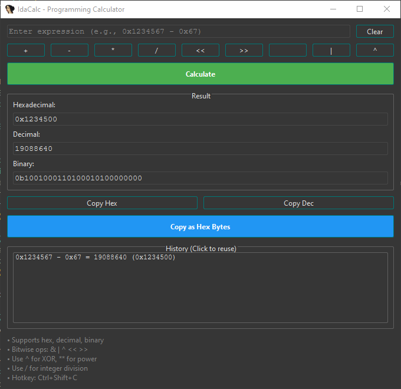

# IdaCalc - Programming Calculator for IDA Pro

IdaCalc is a lightweight programming calculator plugin for **IDA Pro**, designed to simplify calculations during reverse engineering or low-level programming tasks. It supports hexadecimal, decimal, binary, and common bitwise operations, with easy clipboard integration and a history feature.  



---

## Features

- Supports **hexadecimal, decimal, and binary** numbers.
- Common operations: `+`, `-`, `*`, integer division `/`, bitwise `&`, `|`, `^`, `<<`, `>>`.
- Converts results automatically to **hex, decimal, and binary**.
- **Copy results** to clipboard as hex, decimal, or little-endian hex bytes.
- **History feature**: click on previous expressions to reuse them.
- Lightweight **PySide6 GUI** that stays on top of IDA.
- Hotkey support: `Ctrl+Shift+C` to open the calculator quickly.

---

## Installation

1. Copy `IdaCalc-x.x.py` into your IDA Pro `plugins` directory:

   ```text
   <IDA_INSTALL_DIR>/plugins/
   ```

2. Restart IDA Pro.

3. Open the calculator with **Ctrl+Shift+C** or via the IDA Plugins menu.

---

## Usage

1. Enter an expression in the input box:

   ```text
   0x12345678 - 0x67
   ```

2. Click **Calculate**.
3. View results in **Hex**, **Decimal**, or **Binary**.
4. Click **Copy Hex**, **Copy Dec**, or **Copy as Hex Bytes** to copy results to the clipboard.
5. Double-click a previous calculation in the **History** section to reuse it.

---

## Supported Operations

| Operator | Description |
|----------|-------------|
| `+`      | Addition |
| `-`      | Subtraction |
| `*`      | Multiplication |
| `/`      | Integer division |
| `^`      | Power |
| `&`      | Bitwise AND |
| `|`      | Bitwise OR |
| `<<`     | Left shift |
| `>>`     | Right shift |

---

### Requirements

#### IDA Pro 9.2
- Python 3.x support in IDA
- PySide6 installed (`pip install PySide6` if needed)

---

## Contributing

Feel free to open issues or submit pull requests. Suggestions for additional operations, UX improvements, or bug fixes are welcome. Future versions for other IDA releases may be added.

---

## License

MIT License — see [LICENSE](LICENSE) for details.

---

## Support / Donate

[💖 Support my work](https://nowpayments.io/donation/sterncom)